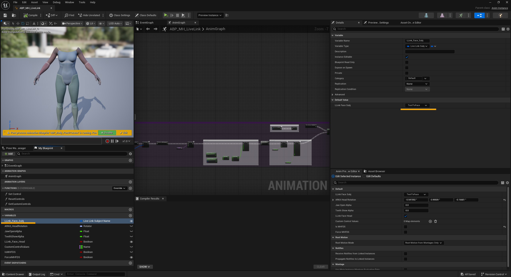
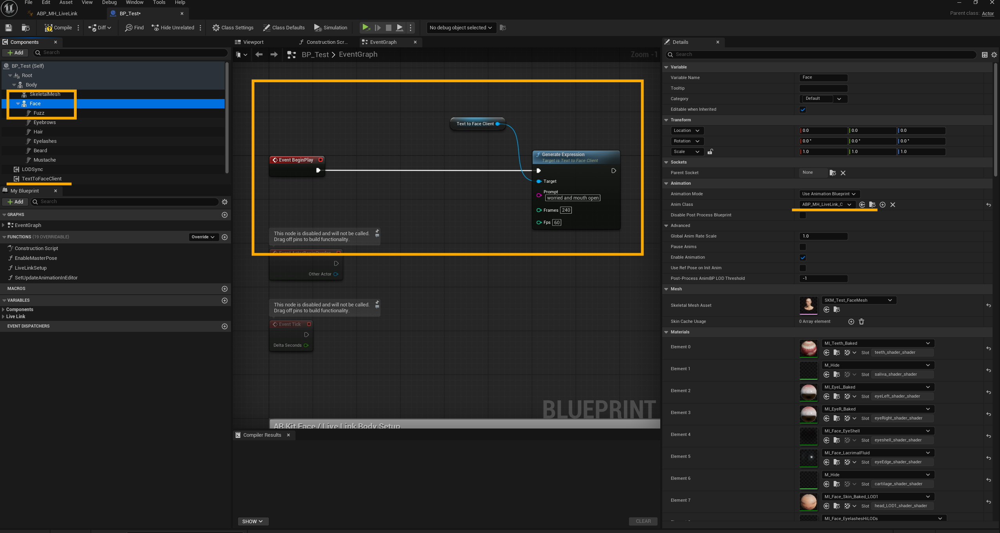

# Text2Face

[](https://youtu.be/tHJkFvBXtaU)

Real-time text-driven facial animation for Unreal Engine MetaHumans. Type a stage direction like *"A person looks surprised"* and watch a MetaHuman's face animate in real-time.

Built on [Express4D](https://github.com/jaron1990/Express4D) data and Apple ARKit blendshape format. Uses a feed-forward transformer to generate 61-channel facial motion from text, served via HTTP to Unreal Engine through LiveLink.

## How It Works

```
Text Prompt ──> Python Server (30ms) ──> HTTP ──> UE Component ──> LiveLink ──> MetaHuman Face
                    |
            CLIP text encoder
            + Transformer (9-48M params)
            + ARKit 61-channel output
```

1. **Python sidecar server** holds a trained TextToFace model resident in GPU memory
2. **UE C++ component** sends prompts via HTTP, receives 61 ARKit face channels per frame
3. **LiveLink source** publishes the data as a LiveLink subject
4. **MetaHuman's LiveLink AnimBP** consumes it through the standard ARKit face pipeline — handling expression mapping, head rotation, and eye gaze natively

## Features

- 52 ARKit facial blendshapes (jaw, mouth, brows, eyes, cheeks, nose)
- Head rotation (yaw, pitch, roll)
- Eye gaze direction (6 channels)
- ~30ms generation latency (on GPU)
- Real-time playback at 60fps
- Blueprint-callable API (`GenerateExpression` node)
- Works with any MetaHuman character

## Project Structure

```
TextToFace/
  python/                    # Python model + sidecar server
    src/
      model.py               # Text2Face transformer architecture
      train.py               # Training loop (weighted channel loss)
      server.py              # FastAPI sidecar (HTTP API for Unreal)
      mh_mapping.py          # ARKit -> MetaHuman curve name mapping
      dataset.py             # Express4D dataset loader
      sample.py              # CLI inference
      export_livelink.py     # Export to LiveLink Face CSV
      plot_sample.py         # Visualize generated curves
      explore_data.py        # Dataset statistics
    stats/                   # Precomputed mean/std for normalization
    requirements.txt
  unreal/                    # UE5 C++ source files
    Source/TextToFace/
      Public/
        TextToFaceClient.h           # HTTP client component
        TextToFaceLiveLinkSource.h   # LiveLink source
        AnimNode_TextToFace.h        # Custom AnimNode (legacy path)
      Private/
        TextToFaceClient.cpp
        TextToFaceLiveLinkSource.cpp
        AnimNode_TextToFace.cpp
      TextToFace.Build.cs            # Module dependencies
```

## Setup

### Prerequisites

- Unreal Engine 5.6+
- Python 3.10+ with CUDA-capable GPU
- A MetaHuman character in your UE project
- MetaHuman Character plugin enabled

### 1. Train the Model

Download the [Express4D dataset](https://github.com/jaron1990/Express4D) (requires Google form).

```bash
# Create conda environment
conda create -n texttoface python=3.11
conda activate texttoface

# Install PyTorch with CUDA
pip install torch torchvision --index-url https://download.pytorch.org/whl/cu124

# Install dependencies
cd python
pip install -r requirements.txt

# Compute dataset statistics
python src/explore_data.py --data-root /path/to/ExpressData

# Train
python src/train.py --data-root /path/to/ExpressData --stats-dir stats
```

Training takes ~10 minutes on an RTX 3080 Ti. The best checkpoint is saved to `checkpoints/best.pt`.

### 2. Start the Server

```bash
python src/server.py --ckpt checkpoints/best.pt --stats-dir stats --port 8765
```

The server loads the model once (~15s) then serves requests in ~30ms.

### 3. Set Up Unreal Engine

**Add C++ to your project:**

1. Copy the files from `unreal/Source/TextToFace/` into your project's `Source/<YourProject>/` directory (merge with existing Public/Private folders)
2. Add these module dependencies to your `.Build.cs`:
   ```csharp
   "HTTP", "Json", "AnimGraphRuntime", "LiveLinkInterface"
   ```
   And for editor builds:
   ```csharp
   if (Target.Type == TargetType.Editor)
   {
       PrivateDependencyModuleNames.AddRange(new string[] { "AnimGraph", "BlueprintGraph" });
   }
   ```
3. Regenerate project files and build

**Configure the MetaHuman:**

1. In the Content Browser, enable **Show Plugin Content** (click the Settings/eye icon)
2. Search for `ABP_MH_LiveLink` — it's at `/MetaHumanCharacter/Animation/ABP_MH_LiveLink`
3. Right-click → **Duplicate** it into your project's Content folder
4. Open the copy, find the `LLinkFaceSubj` variable, set default to `TextToFace`

   

5. In your MetaHuman Blueprint:
   - Add a **TextToFaceClient** component
   - Select the **Face** component → Animation Mode: **Use Animation Blueprint** → Anim Class: your copied `ABP_MH_LiveLink`
6. In BeginPlay, call **GenerateExpression** on the TextToFaceClient component

   

### 4. Test

Press Play. The MetaHuman's face should animate based on the prompt.

For interactive testing, create a UMG widget with a text box and button that calls `GenerateExpression` on the component.

## API

### Python Server

```
GET  /health              → server status
POST /generate            → generate expression curves
  body: {
    "prompt": "A person looks surprised",
    "frames": 240,
    "fps": 60,
    "guidance": 1.5,
    "smooth_window": 5
  }
  response: {
    "arkit_raw": { "EyeBlinkLeft": [...], "HeadYaw": [...], ... },
    "curves": { "ctrl_expressions_jawopen": [...], ... },
    ...
  }
```

#### Parameters

| Parameter | Default | Description |
|---|---|---|
| `prompt` | (required) | Stage-direction text |
| `frames` | 240 | Number of output frames |
| `fps` | 60 | Output frame rate |
| `guidance` | 1.5 | CFG scale. 1.0=off, 1.5=moderate, 2.0=strong exaggeration |
| `smooth_window` | 5 | Post-smoothing window (1=off, 5=gentle, 11=heavy) |

#### Classifier-Free Guidance (CFG)

The model supports classifier-free guidance for controlling expression intensity. During training, captions are randomly dropped 10% of the time to train the unconditional path. At inference:

```
output = unconditional + guidance * (conditional - unconditional)
```

- `1.0` — no guidance (raw model output)
- `1.5` — moderate exaggeration (recommended)
- `2.0` — strong, more dramatic expressions
- `3.0+` — extreme, may produce artifacts

#### Post-Processing

The server applies several post-processing steps:
- **Smoothing**: moving average filter to reduce frame-to-frame jitter
- **Fade-in**: first 30 frames (~0.5s) ramp from zero for smooth blend-in
- **Fade-out**: last 40 frames (~0.66s) decay to zero for smooth blend-out
- **Channel amplification**: blinks (10x), eye gaze (3x) to compensate for training data sparsity

### Blueprint

- `GenerateExpression(Prompt, Frames, Fps)` — fire async generation
- `OnGenerationComplete` — event delegate when response arrives
- `IsPlaying` — check if an animation is currently playing
- `Stop` — halt playback

## Model Architecture (v8)

Feed-forward transformer conditioned on CLIP text embeddings:

- **Text encoder**: Frozen CLIP ViT-B/32 (63M params)
- **Projection**: 512 -> 768-dim MLP
- **Transformer**: 6-layer pre-norm encoder, 12 heads, 2048 ff-dim, 0.25 dropout
- **Output**: 768-dim -> 61 ARKit channels per frame
- **EMA**: exponential moving average of weights for smoother inference
- **Trainable params**: ~48.5M (111.65M total including frozen CLIP)

Loss: Masked L1 + velocity smoothness + acceleration jitter, with per-channel weights boosting blinks (5x), eye gaze (3x), and head rotation (4x). Trained with 10% caption dropout for classifier-free guidance support.

## Acknowledgements

- [Express4D](https://github.com/jaron1990/Express4D) — training dataset
- [Epic Games](https://www.unrealengine.com/) — MetaHuman and LiveLink
- Model architecture inspired by [MDM (Tevet et al.)](https://guytevet.github.io/mdm-page/)

## License

MIT License — see [LICENSE](LICENSE). Model weights are NOT included; if trained on Express4D, they are subject to Express4D's license terms.
